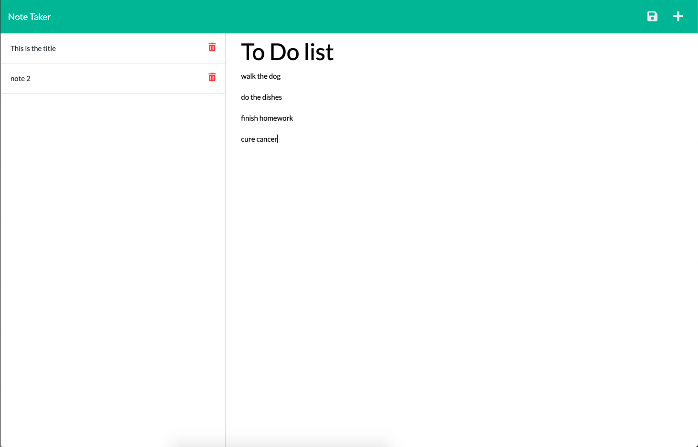

# 11 Express.js: Note Taker

Note taker:
Click the title area to add a title to a new note. Click the body to ass a body to a new note. Click the save icon to save the note to the list of notes on the left-hand bar. Click any of the previous notes to bring that note back up. Click the delete button of any particular note to delete that note.

Created by David Ludwik

The program runs on a node server and, with the help of the express library, implements the dynamic functionality via fetch requests from the frontend js file(index.js) to hit the api routes designated in the api folder. The note text is stored in a json file. The server also handles the routing for the front end webpages. A get method populates the notes on page load. A post method handles the posting of a new note(simply appending it to the json file), and a delete method deletes the note from the file. The screen is refreshed upon posting or deleting to show updated content.

